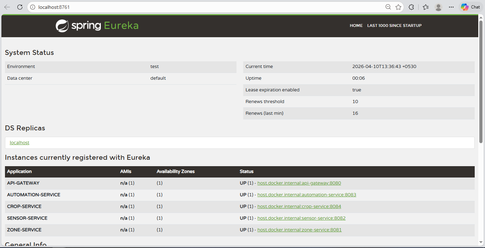

# Automated Greenhouse Management System (AGMS)

This is a Microservices-based Automated Greenhouse Management System (AGMS) built using Spring Boot and Spring Cloud. 
The system is designed to manage various aspects of a greenhouse such as climate zones, crops, sensor data, and automated systems across distributed microservices.



## 🏗 Project Architecture & Structure

The project follows a standard microservices architecture with a central API Gateway and Eureka Service Registry.

```text
agms-project/
├── api-gateway/            # Routes external requests to appropriate services, handles JWT Auth (Port: 8080)
├── discoveryservice/       # Netflix Eureka Server for service registration & discovery (Port: 8761)
├── config-server/          # Centralized configuration management using Spring Cloud Config (Port: 8888)
├── config-repo/            # Git repository storing configurations for each service
├── zone-service/           # Manages Greenhouse Climate Zones (Temp, etc.) (Port: 8081)
├── sensor-service/         # Handles Sensor Data Processing (Port: 8082)
├── automation-service/     # Handles Automation logic (Port: 8083)
├── crop-service/           # Manages Crops and their status (Port: 8084)
├── .env                    # Global environment variables containing sensitive Database credentials
└── AGMS_Postman_Collection.json # Postman API Collection for testing
```

## 🛠 Technologies Used

- **Java 17** - Core programming language.
- **Spring Boot 3.x / 4.x** (simulated) - Framework for building microservices.
- **Spring Cloud** (Gateway, Netflix Eureka, Config) - For distributed system architecture.
- **Spring Data JPA & Hibernate** - Object-Relational Mapping (ORM) and Database interactions.
- **MySQL (v8.x)** - Primary relational database for all services.
- **JWT (JSON Web Token)** - For secure authentication and authorization via the API Gateway.
- **Maven** - Project build and dependency management.
- **Spring Dotenv** - Easy environment variable (`.env`) management.

## 🚀 How to Run the Application

**Important Prerequisites:**
Make sure MySQL is running on your local machine (`localhost:3306`) before starting the services. The database schemas (`zone_db`, `automation_db`, `crop_db`, `sensor_db`) will be automatically created.

**Start Order:**
For the system to boot successfully, the services must be started in the following order:

1. **`discoveryservice`** (Eureka Server)
2. **`config-server`** (Config Server)
3. **`api-gateway`** (Wait for this to register with Eureka)
4. **All other microservices** (`zone-service`, `crop-service`, `sensor-service`, `automation-service`)

> **Note on IntelliJ IDEA execution:** 
> We have implemented a foolproof fallback mechanism inside the local `application.yml` files (e.g., `DB_USERNAME: root`). Even if IntelliJ IDEA does not load `.env` due to working directory mismatches, the application will successfully fall back to `root` and the defined password.

## 🧪 API Testing Instructions (Postman)

We have provided a fully configured Postman collection for you to test your APIs easily.
1. Open Postman.
2. Click **Import** and select the `AGMS_Postman_Collection.json` file located in the root of this project.
3. First, execute the **Auth - Login** request. This will generate a JWT Token in the response.
4. Copy the received `token`.
5. For all other requests (Zones, Crops, etc.), go to the **Headers** or **Authorization** tab, and set the Bearer Token to the one you just copied. 
6. Happy testing!
